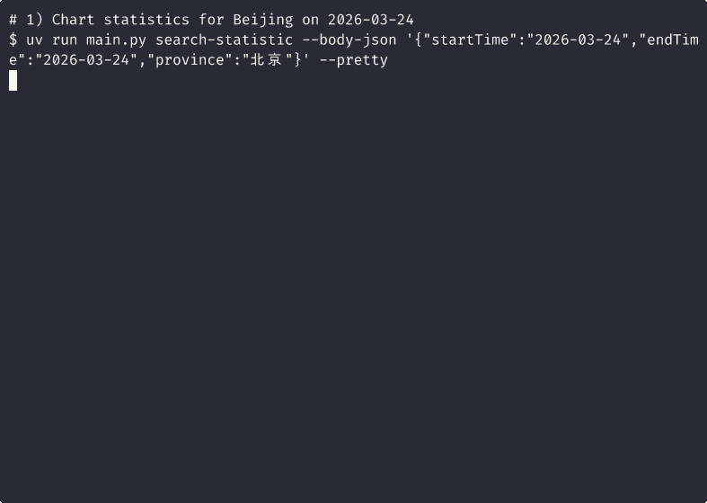

# Birdrecord CLI

CLI for the [Birdrecord](https://www.birdreport.cn/) / China Bird Record mini-program API. HTTP defaults to API host `https://weixin.birdrecord.cn` (override with `--base-url`); the [portal site](https://www.birdreport.cn/) is separate.

**Species taxonomy**: Checklist entries, names, and `taxonid` values match the app and follow **Zheng 4**—the 4th edition of *A Checklist of the Birds of China* (中国鸟类分类与分布名录·第四版, “郑四”).

## Install from PyPI

Requires **Python 3.12+**.

```bash
pip install birdrecord-cli
# or: uv tool install birdrecord-cli
birdrecord-cli --help
```

Package index: [pypi.org/project/birdrecord-cli](https://pypi.org/project/birdrecord-cli/).

## Run with uvx (no prior install)

[uv](https://docs.astral.sh/uv/) downloads the package into an ephemeral environment. Pin the version for reproducible behavior:

```bash
uvx --from 'birdrecord-cli==0.1.0' birdrecord-cli --help
uvx --from 'birdrecord-cli==0.1.0' birdrecord-cli provinces --pretty
```

Use the latest release version from PyPI if it differs from the example above.

## Single-file + uv (no install)

[PEP 723](https://peps.python.org/pep-0723/) script; [uv](https://docs.astral.sh/uv/) installs deps automatically.

```bash
curl -fsSL -o main.py 'https://raw.githubusercontent.com/yoshino-s/birdrecord-cli/main/main.py'
uv run main.py --help
```

For a fork, change `yoshino-s` and/or `main` in the URL.

## Usage

Shared flags: `--token`, `--base-url`, `--no-verify`, `--timeout`, `--pretty`, `--envelope`. Subcommands: `provinces`, `cities`, `taxon`, `report`, `search`; most support `--schema`. `search` accepts optional `--taxon` / `--report` for activity drill-down; stdout JSON shapes are described in [docs/CLI.md](docs/CLI.md) under **`search` output (JSON)**. Full copied `--help` text: [docs/CLI.md](docs/CLI.md).

```bash
birdrecord-cli provinces --pretty
birdrecord-cli report --id 1948816 --pretty
birdrecord-cli search --body-json '{"startTime":"2026-02-24","endTime":"2026-03-24","province":"河北省","taxonid":4148,"version":"CH4"}' --pretty
```

(With `uv run main.py`, use the same subcommands after `uv run main.py`.)

Environment variables:

- `BIRDRECORD_CACHE_DIR`: optional taxon cache root (`…/taxon`); if unset, `$XDG_CACHE_HOME/birdrecord/taxon` when `XDG_CACHE_HOME` is set, else `~/.cache/birdrecord/taxon`.
- `BIRDRECORD_CLI_CN`: any truthy value (not `0` / `false` / `no` / `off`) uses Chinese JSON Schema descriptions (e.g. `--schema`).

## Demo



## Development

Clone, then `uv sync --group dev && uv run pytest tests/ -v` (some tests hit the live API; some use `verify=False`). Tests import via [`birdrecord_client.py`](./birdrecord_client.py).

## License

MIT — see [LICENSE](LICENSE).

---

**中文说明**：[README.zh-CN.md](./README.zh-CN.md)
